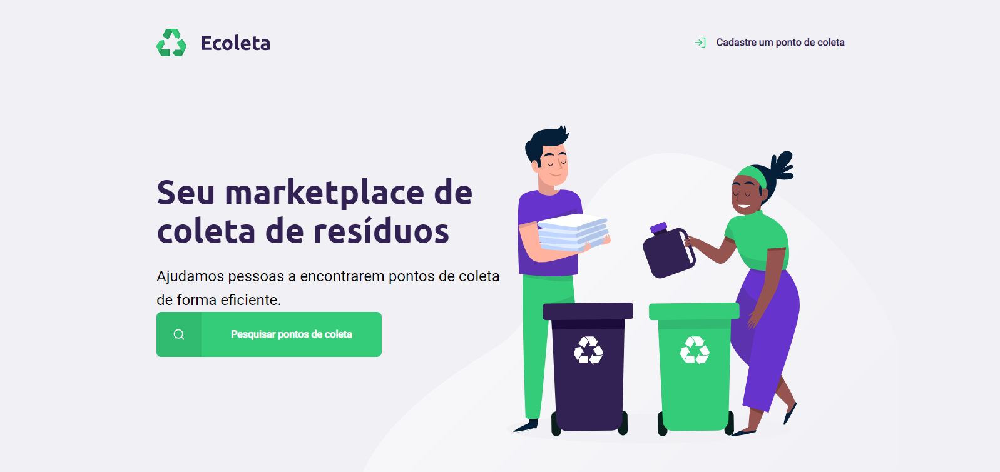
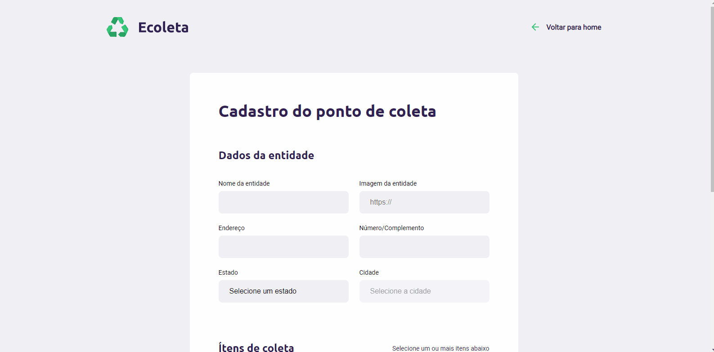
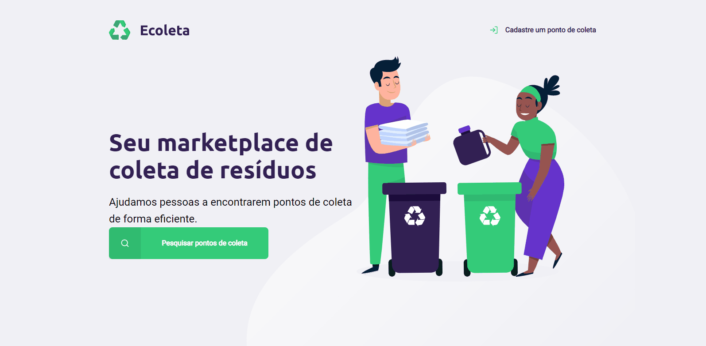

# ♻ Ecoleta

## Sobre
Ecoleta é um projeto realizado durante a Next Level Week (antiga Semana OmniStack), um evento realizado pela [*rocketseat*](https://rocketseat.com.br/) com a finalidade de *elevar o conhecimento do participante para o próximo nível!*.

## Finalidade da aplicação
Permitir com que empresas registrem seus pontos de coleta, facilitando o usuário a encontrar um local de descarte adequado na sua cidade.

---

# ⚙️ Funcionamento da Aplicação
## Cadastro 📋
As empresas com interesse em cadastrar um ponto de coleta, preenchem um formulário simples, contendo os dados do ponto de coleta.

## Pesquisa 🔍
Os usuários podem utilizar o mecanismo de busca para procurar os pontos de coleta na sua cidade.

---

# 💻 Tecnologias usadas

* HTML5
* CSS3
* Javascript
* Node.JS
* Express
* Nunjucks
* SQLite3

---

# 👨‍💻 Instalação

1. Clone o repositório para sua máquina
2. No terminal, instale as dependencias com o comando `npm install`
3. Inicie o servidor com o comando `npm start`
4. Abra o seu navegador e digite `localhost:3000`

---

# :rocket: Agradecimentos especiais

Gostaria de agradecer a equipe da rocketseat e a comunidade do discord pela oportunidade e experiencia adquirida no evento, em especial ao [Myke Brito](https://twitter.com/maykbrito) por suas contribuições e por compartilhar seu conhecimento conosco.
