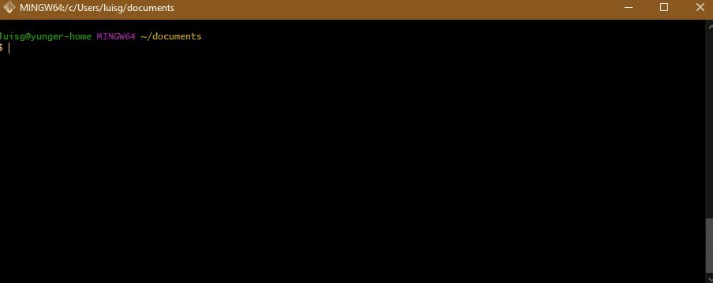
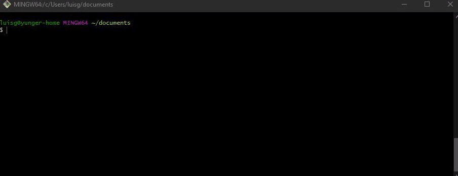
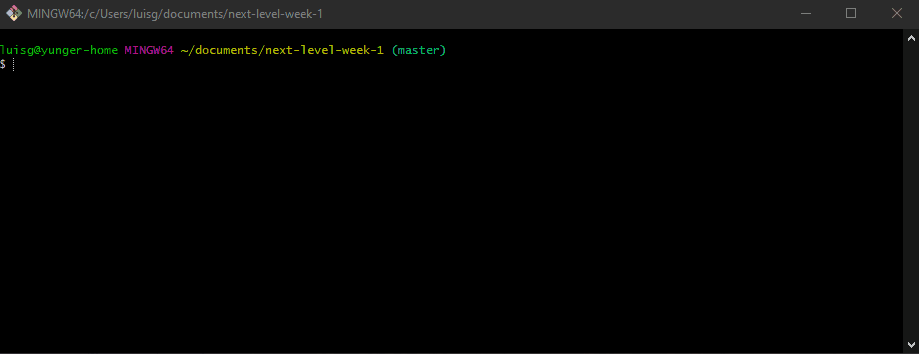
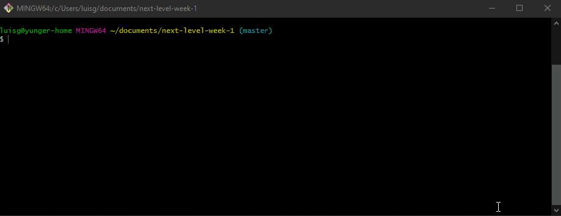
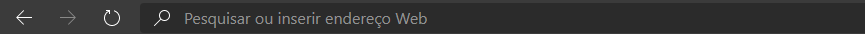

# Guia de instalação do projeto

Neste guia você encontra de forma detalhada, passo a passo de como instalar o projeto na sua máquina. Então, vamos direto ao ponto!

1. Clone o projeto para a sua máquina, você pode fazer isso da seguinte forma: (uma das maneiras).

Abra o git bash e digite `git clone https://github.com/yunger7/Next-Level-Week-1.git`

2. Vá até o local do repositório

3. Instale todas as dependências do projeto. Para isso, utilize o comando `npm install`

4. Inicie o servidor com o comando `npm start`

4. Por fim, abra o seu navegador e digite `localhost:3000`

E pronto! Seu projeto já esta rodando no seu computador. Caso ainda haja dúvidas ou exista algum problema você pode abrir uma issue ou entrar em contato comigo pelo discord.
